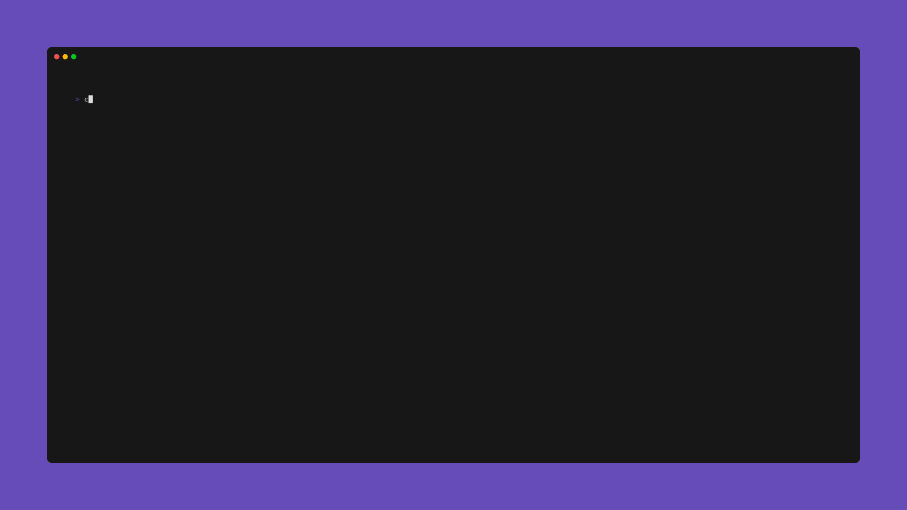

<div align="center">
<h1>chess</h1>
A chess TUI implementation in rust
</div>



[](https://github.com/nindob/chess/actions/workflows/flow_test_build_push.yml)
[](https://opensource.org/licenses/MIT)

### Demo

**With docker**

```bash
docker run --rm -it ghcr.io/nindob/chess:main
```

**With Cargo**
```
git clone git@github.com:nindob/chess.git
cd chess
cargo build --release
./target/release/chess
```
