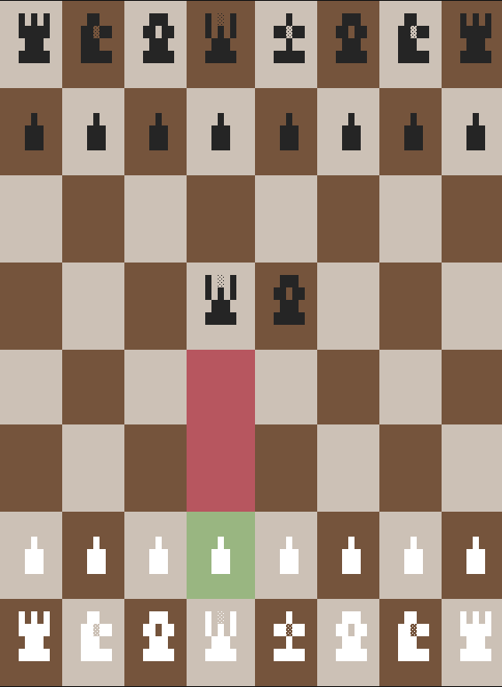

# chess
A chess tui implementation in rust

⚠️ THIS PROJECT IS STILL IN DEVELOPMENT ⚠️ 

### Roadmap

- ✅ Board render
- ✅ piece authorized moves
- Game logic 
- Win conditions
- Menu
- Last moves historic
- UCI compatibility
